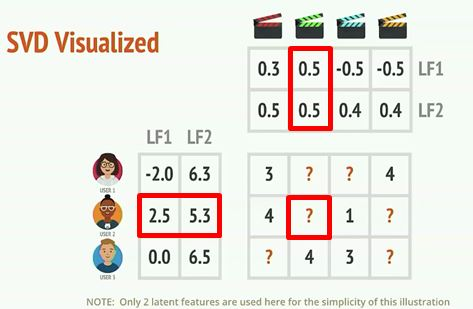
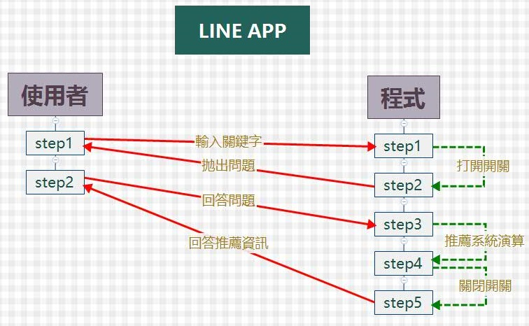
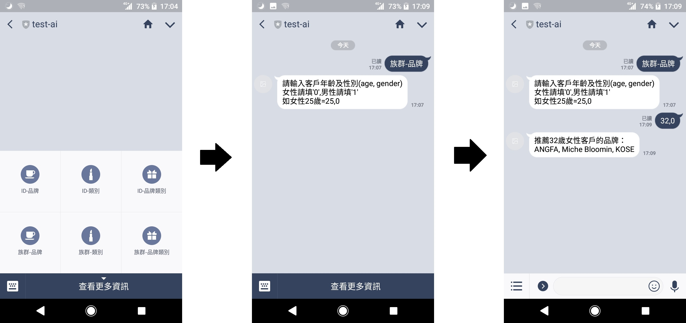

# Line APP 推薦系統

## 大綱
>* 範例資料描述
>* 開發工具與需求
>* 推薦系統
>>1. [過去消費紀錄推薦](https://github.com/s1002574/LINE_RecommendSys_Demo/tree/master/recommand_system/recomand_by_user_log.ipynb)
>>2. [消費者族群推薦](https://github.com/s1002574/LINE_RecommendSys_Demo/tree/master/recommand_system/group_top3_recommand.ipynb)
>* APP 互動介面
>>* 概念說明
>>* 運作方式

## 範例資料描述
### 1. 欄位選擇:
>* 雖逐筆交易中以商品名稱作為品項，但因品項過多且交易筆數過少,遂以品牌與商品種類作為推薦品項。
>* 由數量呈單價而非數量作為逐筆訂單分數以避免總是推薦低價商品的問題。
### 2.  資料說明:
#### (1) [all_data.csv](https://github.com/s1002574/LINE_RecommendSys_Demo/tree/master/recommand_system/data/all_data.csv)

| **英文欄位** |  **中文欄位** || **英文欄位** |  **中文欄位** |
|---------|----------|---|---------|----------|
|cart_id|購物車id||member_id|會員編號|
|retailer|通路||address|通路地址|
|channel|訂單來源||category|商品類別|
|brand|商品品牌||item|商品名稱|
|cnt|商品數量||per_price|單價|
|shipping_fee|運費||discount|折扣|
|payment|付款方式||attribute|商品屬性|
|additional_purchase|加價購||age|顧客年齡|
|regist_days|註冊期長||last_purchaseday|最後消費間隔|
|tol_purchase_price|會員總消費金額||tol_purchase_time|會員總消費次數|
|gender|性別||membership_source|會員資料來源|

#### (2) 產品類別代號對照表:

|**類別**|**代號**||**類別**|**代號**|
|---|---|---|---|---|
|去角質|1||沐浴|2|
|其他|3||卸妝|4|
|底妝|5||保濕|6|
|持妝|7||洗髮|8|
|洗顏|9||眉毛|10|
|美白|11||眼線|12|
|睫毛|13||補妝|14|
|遮瑕|15||護唇|16|

#### (3) 性別代號對照表:
|**類別**|**代號**|
|---|---|
|未知|-1|
|女|0|
|男|1|

## 開發工具與需求
>* Python 3.6
>* Python Modules: pandas, numpy, surprise
>* Vitural C++ 14.0以上版本
>* 資料輸出/入格式:  csv

## 推薦系統
>* 有顧客過去消費紀錄: 由過去顧客消費紀錄中藉由相似消費紀錄者喜好商品作為推薦。
>* 顧客無過去消費紀錄: 將顧客依基本信息分群，找出族群偏好作為推薦。

### 1. 有過去消費紀錄推薦:
>* 由顧客對某一商品類別,品牌或類別品牌組合的累積消費額作為喜好分數。
>* 由逐筆訂單資料中整理得出資料後。以SVD推薦系統投影至50個隱藏因素計算得分後做推薦。
>> 
>* 資料輸入格式(由逐筆訂單資料中整理得出):

|**欄位**|**說明**||**欄位**|**說明**|
|---|---|---|---|---|
|cart_id|訂單編號||Member_id|會員編號|
|Category|消費商品類別||Brand|消費商品品牌|
|cnt|商品數量||per_price|商品單價|
|Score|Cnt*per_price|

> >* 輸出資料格式 (對各user推薦前三名品牌,類別與品牌類別組合):

(1). [**使用者-品牌推薦:**](https://github.com/s1002574/LINE_RecommendSys_Demo/tree/master/result/recommand_brand.csv)

|  |recommand_1|recommand_2|recommand_3|
|--|--|--|--|
|User_id|KOSE|DASODA|MicheBloomin|
|...|...|...|...|

(2). [**使用者-類別推薦:**](https://github.com/s1002574/LINE_RecommendSys_Demo/tree/master/result/recommand_category.csv)

|  |recommand_1|recommand_2|recommand_3|
|--|--|--|--|
|User_id|美白|持妝|補妝|
|...|...|...|...|

(3). [**使用者-組合推薦:**](https://github.com/s1002574/LINE_RecommendSys_Demo/tree/master/result/recommand_brand_category.csv)

|  |recommand_1|recommand_2|recommand_3|
|--|--|--|--|
|User_id|('睫毛', 'FLOWFUSHI ')|('補妝', 'BEAUTYMAKER')|('保濕', 'KOSE')|
|...|...|...|...|

### 2. 消費者族群推薦:
>* 因顧客無過去消費紀錄，故將顧客依基本信息分群，找出族群偏好作為推薦。將顧客依資料年齡特徵分為6個級距;性別分為男女與未知。因此產生18個族群。針對個別族群計算商品喜好程度作為件依據。如族群未知或無資料則推薦[全體喜好前三名](https://github.com/s1002574/LINE_RecommendSys_Demo/tree/master/result/top_n_brand.csv)商品。
>* 資料輸入格式(由逐筆訂單資料中整理得出):

|**欄位**|**說明**||**欄位**|**說明**|
|---|---|---|---|---|
|Member_id|會員編號||Age|顧客年齡|
|Gender|顧客性別||Category|消費商品類別|
|Brand|消費商品品牌||cnt|商品數量|
|per_price|商品單價||Score|Cnt*per_price|
> >* 輸出資料格式:
>>* 推薦各族群前三名的品牌,類別與品牌類別組合。
>>* 資料依各族群內分數前三名遞減排序。
>>* Example:

(1).[**族群-品牌推薦:**](https://github.com/s1002574/LINE_RecommendSys_Demo/tree/master/result/group_top_n_brand.csv)

|group|brand|score|
|--|--|--|
|5_0|KOSE|6399|
|...|...|...|

(2).[**族群-類別推薦:**](https://github.com/s1002574/LINE_RecommendSys_Demo/tree/master/result/group_top_n_category.csv)

|group|categoty|score|
|--|--|--|
|5_0|洗髮|3570|
|...|...|...|

(3).[**族群-組合推薦:**](https://github.com/s1002574/LINE_RecommendSys_Demo/tree/master/result/group_top_n_pair.csv)

|group|score|categoty|brand|
|--|--|--|--|
|5_0|3570|洗髮|ANGFA|
|...|...|...|...|

## APP互動介面:

### 1. 概念說明:

此APP為一個透過LINE來操作，通過判定使用者輸入的指令及關鍵字，搜索內部資料來進行回應的聊天機器人。
其指令內容通過LINE @來設計6個按鍵，通過按鍵自動發送搜尋關鍵字，可讓使用者輕易選定想進行搜索的類別。

### 2. 運作方式:

將運作程式碼及讀取檔案放置於GitHub，並通過連結GitHub，將程式及資料部屬於Heroku平台上。
最後再利用LINE Developers連結Heroku平台並發布。
當有新的使用者加入時，會將使用者資訊新建立資料於mangodb的table上，包含用戶ID、名稱、建立時間等資訊，程式端可利用ID識別不同用戶的操作行為。

### 3. 操作流程:

首先使用者可透過掃描QR Code加入APP。   
   
之後使用者可於下方選單介面選擇想要查詢的項目，系統會自動將其轉為關鍵字傳給程式端。
當使用者(透過Line的圖文介面)送出關鍵字命令，程式端會將對應的Flag開啟。並觸發事件拋出問題請使用者輸入ID或年齡性別。
使用者輸入後，程式端會依據回答，於後台搜尋依據推薦系統找出的推薦品牌、類別回應使用者，同時將先前開啟的Flag關閉。

